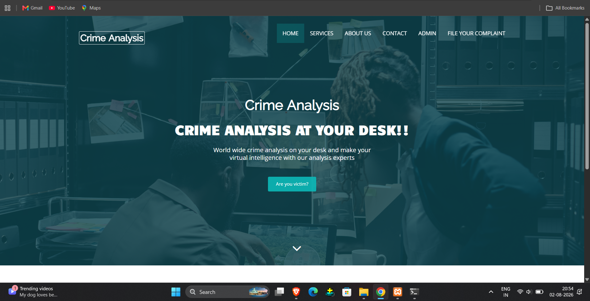
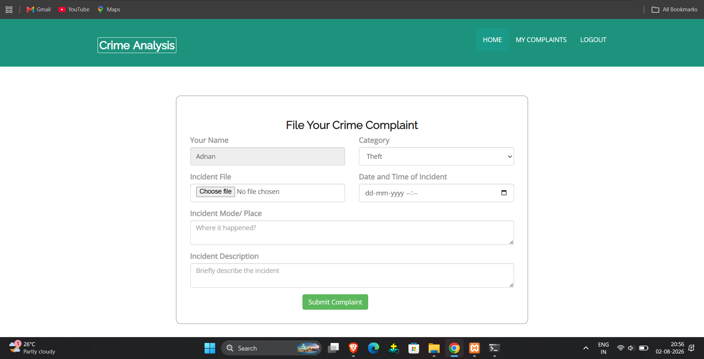
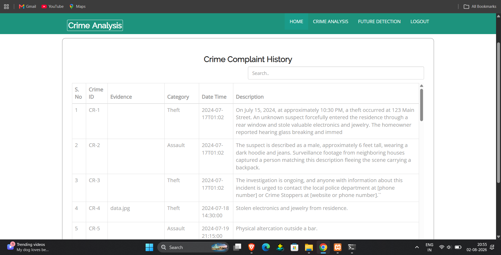
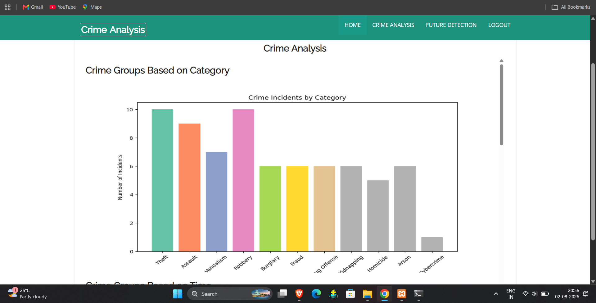
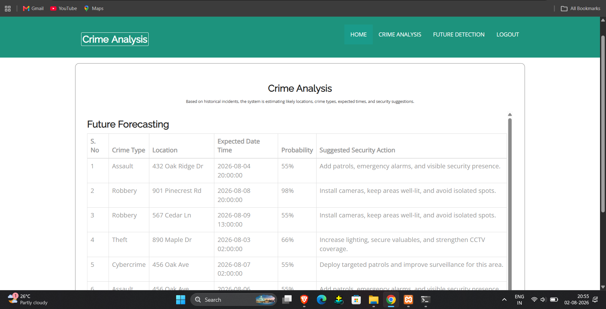

# 🚔 Crime Analysis and Prediction System

A Flask-based web application for crime complaint management, crime analysis, and future crime prediction using Machine Learning. The system enables users to submit crime complaints, while administrators can analyze crime trends, manage complaints, and view predictive insights for future crime occurrences.

---

## 📌 Project Overview

The Crime Analysis and Prediction System is designed to simplify crime reporting and assist law enforcement authorities by analyzing historical crime data. The application provides a centralized platform where users can file complaints, and administrators can monitor crime statistics, analyze trends, and view future crime predictions.

---

## ✨ Features

### 👤 User Module
- User Registration and Login
- File Crime Complaints
- Upload Evidence
- View Submitted Complaints

### 🔐 Admin Module
- Secure Admin Login
- View and Manage Crime Complaints
- Search Complaint Records
- Crime Analysis Dashboard
- Future Crime Prediction
- View Crime Statistics

### 📊 Analysis Module
- Crime Category Analysis
- Crime Trend Visualization
- Crime Distribution Charts
- Historical Crime Data Analysis

### 🤖 Prediction Module
- Predict Future Crime Trends
- Display Expected Crime Type
- Predicted Location
- Probability of Crime
- Suggested Security Actions

---

## 🛠 Technologies Used

### Frontend
- HTML5
- CSS3
- Bootstrap
- JavaScript

### Backend
- Python
- Flask

### Database
- MySQL

### Machine Learning
- Scikit-learn
- Pandas
- NumPy

### Development Tools
- Visual Studio Code
- XAMPP
- Git
- GitHub

---

## 📂 Project Structure

```
crime-analysis-prediction-system/
│
├── app.py
├── db/
├── static/
├── templates/
├── uploads/
├── README.md
└── requirements.txt (if available)
```

---

## ⚙️ How It Works

1. User registers and logs into the system.
2. User submits a crime complaint with incident details and evidence.
3. Complaint information is stored in the MySQL database.
4. The administrator reviews and manages complaints.
5. Historical crime data is analyzed to identify crime patterns.
6. Machine Learning is used to estimate future crime trends.
7. The system displays predictions along with suggested security measures.

---

## 📸 Application Screenshots

### Home Page


### User Complaint Form


### Admin Dashboard


### Crime Analysis


### Future Prediction


---

## 🎯 Future Enhancements

- Real-time crime prediction
- Interactive charts and dashboards
- Email and SMS notifications
- GIS/Google Maps integration
- Mobile application support
- Role-based access control
- Live police database integration

---

## 🎓 Academic Project

This project was developed as part of the **Master of Technology (M.Tech) in Computer Science** academic work.

---

## 👨‍💻 Author

**Syed Adnan Ahmed**

- 📧 Email: syedadnan13786@gmail.com
- 💼 LinkedIn: https://www.linkedin.com/in/syedadnan13786/
- 🌐 Portfolio: https://syedadnan-7.github.io/
- 💻 GitHub: https://github.com/syedadnan-7

---

## ⭐ If you found this project useful, consider giving it a Star!
